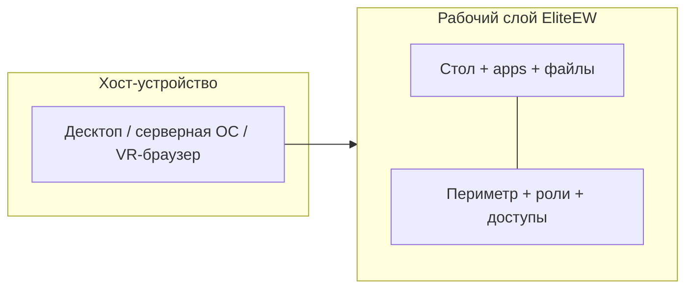

# D01 — Hybrid formula (P1)

```mermaid
flowchart LR
  subgraph Host["Хост-устройство"]
    OS["Десктоп / серверная ОС / VR-браузер"]
  end
  subgraph Elite["Рабочий слой EliteEW"]
    Desk["Стол + apps + файлы"]
    Sec["Периметр + роли + доступы"]
  end
  OS --> Elite
  Desk --- Sec
```

**Смысл:** EliteEW — управляемый слой поверх устройства, не «выбросили ядро ОС».
