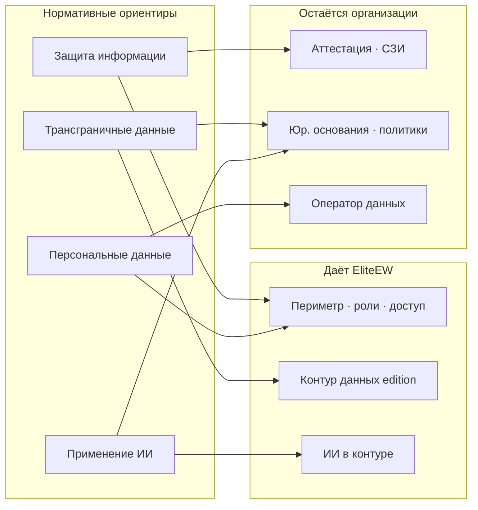

# D03 — Нормы: даёт EliteEW / остаётся организации (P3)

```mermaid
flowchart LR
  subgraph NPA["Нормативные ориентиры"]
    N1["Защита информации"]
    N2["Трансграничные данные"]
    N3["Применение ИИ"]
    N4["Персональные данные"]
  end
  subgraph EE["Даёт EliteEW"]
    E1["Периметр · роли · доступ"]
    E2["Контур данных edition"]
    E3["ИИ в контуре"]
  end
  subgraph Cust["Остаётся организации"]
    C1["Аттестация · СЗИ"]
    C2["Юр. основания · политики"]
    C3["Оператор данных"]
  end
  N1 --> E1
  N1 --> C1
  N2 --> E2
  N2 --> C2
  N3 --> E3
  N3 --> C2
  N4 --> E1
  N4 --> C3
```

**Alt:** Карта «помогает / не заменяет» — не аттестат.
