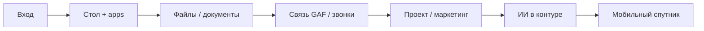

# D04 — День сотрудника (P3a)

```mermaid
flowchart LR
  S1["Вход"] --> S2["Стол + apps"]
  S2 --> S3["Файлы / документы"]
  S3 --> S4["Связь GAF / звонки"]
  S4 --> S5["Проект / маркетинг"]
  S5 --> S6["ИИ в контуре"]
  S6 --> S7["Мобильный спутник"]
```

**Alt:** Один swimlane внутреннего внедрения; детали глав — по ссылкам в P3a.
