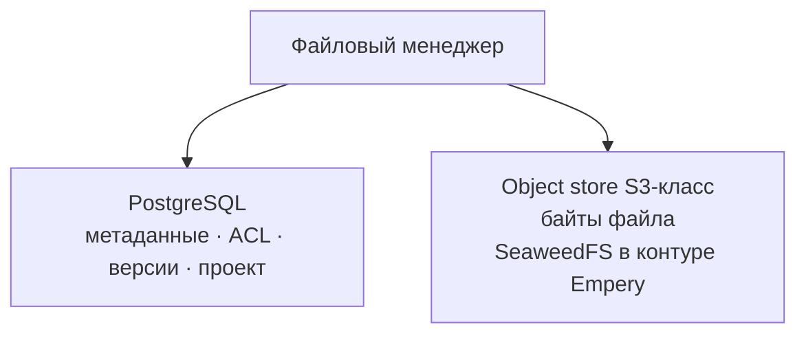

# D05 — Файлы: две плоскости (P4a)

```mermaid
flowchart TB
  UI["Файловый менеджер"]
  PG["PostgreSQL\nметаданные · ACL · версии · проект"]
  OBJ["Object store S3-класс\nбайты файла\nSeaweedFS в контуре Empery"]
  UI --> PG
  UI --> OBJ
```

**Смысл:** права и каталог в БД; содержимое — в объектном хранилище; пользователь не ходит в PG/Seaweed руками.
