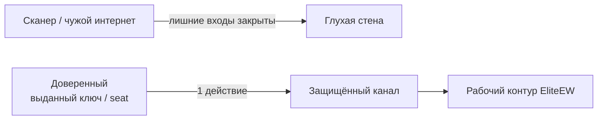

# D06 — Edge: стена и 1 клик (P7d)

```mermaid
flowchart LR
  Scan["Сканер / чужой интернет"] -->|лишние входы закрыты| Wall["Глухая стена"]
  Trust["Доверенный\nвыданный ключ / seat"] -->|1 действие| Chan["Защищённый канал"]
  Chan --> Work["Рабочий контур EliteEW"]
```

**Смысл:** default-deny снаружи; allow только по выданному доверию. Без IP/портов на схеме.
