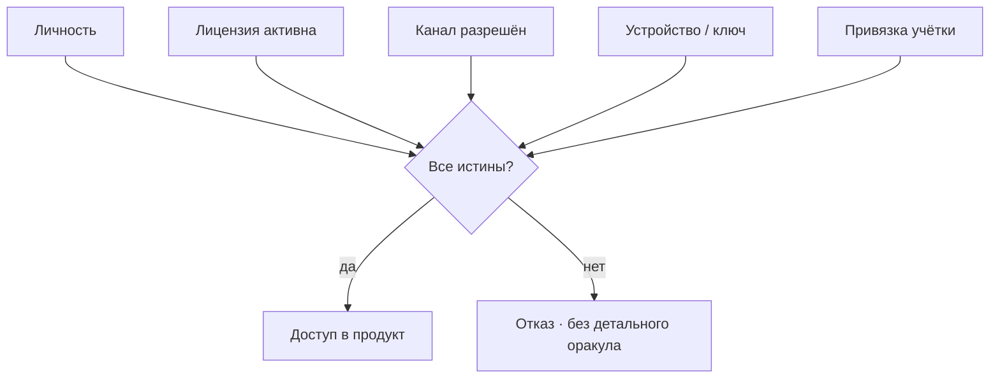

# D07 — Atomic access (P8a)

```mermaid
flowchart TB
  I["Личность"] --> AND{"Все истины?"}
  L["Лицензия активна"] --> AND
  C["Канал разрешён"] --> AND
  D["Устройство / ключ"] --> AND
  B["Привязка учётки"] --> AND
  AND -->|да| OK["Доступ в продукт"]
  AND -->|нет| DENY["Отказ · без детального оракула"]
```

**Смысл:** native Connected / FoFline — связка факторов; не универсально для любого браузерного входа.
**Alt:** Условный доступ как логическое И, не один пароль.
