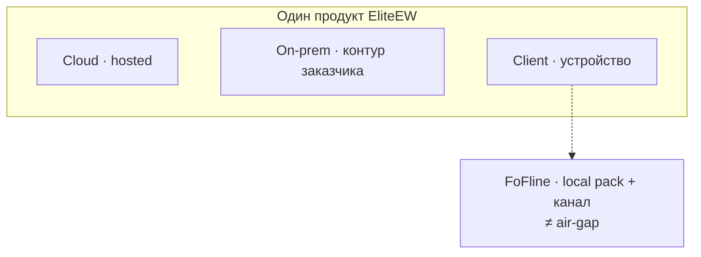

# D08 — Editions (P10)

```mermaid
flowchart TB
  subgraph One["Один продукт EliteEW"]
    Cloud["Cloud · hosted"]
    Onprem["On-prem · контур заказчика"]
    Client["Client · устройство"]
  end
  FoF["FoFline · local pack + канал\n≠ air-gap"]
  Client -.-> FoF
```

**Alt:** Три edition + FoFline как client-adjacent; не три разных продукта и не air-gap.
