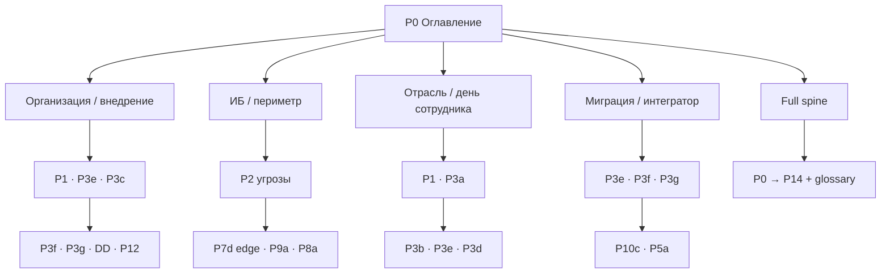

# D10 — Reading paths (P0)

```mermaid
flowchart TB
  P0["P0 Оглавление"]
  P0 --> ORG["Организация / внедрение"]
  P0 --> CISO["ИБ / периметр"]
  P0 --> IND["Отрасль / день сотрудника"]
  P0 --> SI["Миграция / интегратор"]
  P0 --> FULL["Full spine"]
  ORG --> A1["P1 · P3e · P3c"]
  A1 --> A2["P3f · P3g · DD · P12"]
  CISO --> C1["P2 угрозы"]
  C1 --> C2["P7d edge · P9a · P8a"]
  IND --> I1["P1 · P3a"]
  I1 --> I2["P3b · P3e · P3d"]
  SI --> S1["P3e · P3f · P3g"]
  S1 --> S2["P10c · P5a"]
  FULL --> F1["P0 → P14 + glossary"]
```

**Смысл:** входы для организации, ИБ, отрасли и внедрения — без рекламного захода.
