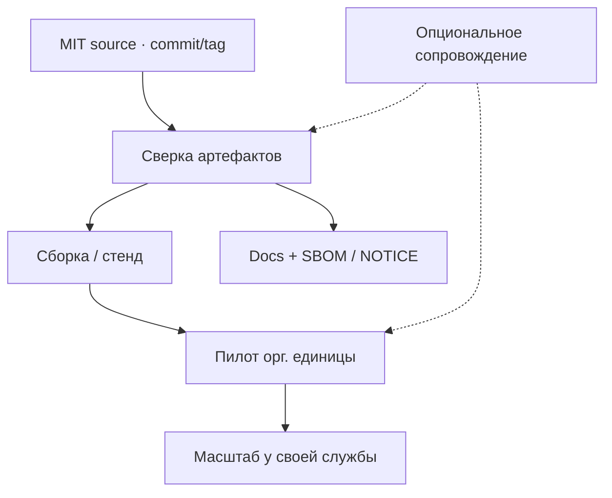

# D12 — Принять дар у себя (P3f)

```mermaid
flowchart TB
  Source["MIT source · commit/tag"]
  Source --> Check["Сверка артефактов"]
  Check --> Build["Сборка / стенд"]
  Check --> Docs["Docs + SBOM / NOTICE"]
  Build --> Pilot["Пилот орг. единицы"]
  Pilot --> Scale["Масштаб у своей службы"]
  Help["Опциональное сопровождение"] -.-> Check
  Help -.-> Pilot
```

**Смысл:** исходники открыты по MIT; приёмка у себя сверяет версию, сборку,
документацию и границы. Чужие prod-секреты в «дар» не входят.
