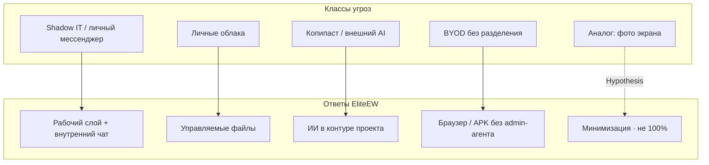

# D02 — Классы угроз → ответы (P2)

```mermaid
flowchart TB
  subgraph Threats["Классы угроз"]
    T1["Shadow IT / личный мессенджер"]
    T2["Личные облака"]
    T3["Копипаст / внешний AI"]
    T4["BYOD без разделения"]
    T5["Аналог: фото экрана"]
  end
  subgraph Answers["Ответы EliteEW"]
    A1["Рабочий слой + внутренний чат"]
    A2["Управляемые файлы"]
    A3["ИИ в контуре проекта"]
    A4["Браузер / APK без admin-агента"]
    A5["Минимизация · не 100%"]
  end
  T1 --> A1
  T2 --> A2
  T3 --> A3
  T4 --> A4
  T5 -.->|"Hypothesis"| A5
```

**Alt:** Поток «угроза → ответ продукта»; пунктир — граница абсолюта.
