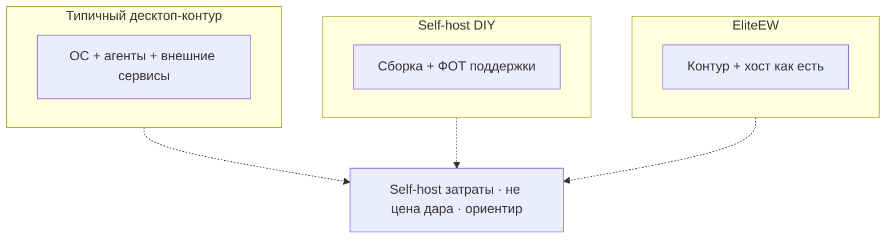

# D09 — Структура затрат: три колонки (P3d)

```mermaid
flowchart TB
  subgraph Win["Типичный десктоп-контур"]
    W1["ОС + агенты + внешние сервисы"]
  end
  subgraph Ubu["Self-host DIY"]
    U1["Сборка + ФОТ поддержки"]
  end
  subgraph EE["EliteEW"]
    E1["Контур + хост как есть"]
  end
  Note["Self-host затраты · не цена дара · ориентир"]
  Win -.-> Note
  Ubu -.-> Note
  EE -.-> Note
```

**Alt:** Структура сравнения затрат без ложной точности цифр.
